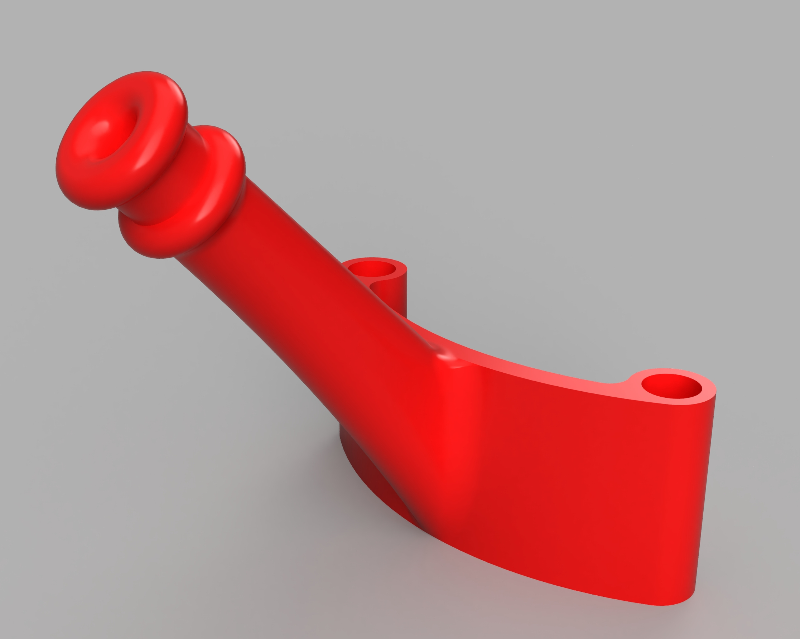

# HDZero Freestlye Antenna Universal Standoff Mount

FDM universal mount for the HDZero antenna bundled with the Freestyle VTX

# Tips:

I have not print tested this specific model but it follows my design methodology for other custom mounts.

Recommend TPU with a 0.4mm nozzle and 0.2mm layer height.

I prefer Ninjatek Cheetah filament and a nice slow speed for best quality.

Standoff spacing is 40mm but the arc section is intended to flex and accomodate a variety of spacings.

Tube length is 40mm. If you have trouble getting the UFL through the tip, slice the tip down the tube for about 10-15mm to peel it open.

Bosses for zip tie retention to improve stability and protect coax.
